# Steps to Deploy the DLP Access Demo Website using Amplify Console

## Step 1: Deploy the demo website in the Amplify console
* Go to [Launching the app](https://github.com/VTUL/dlp-access#launching-the-app) section and click the `Deploy to Amplify console` button

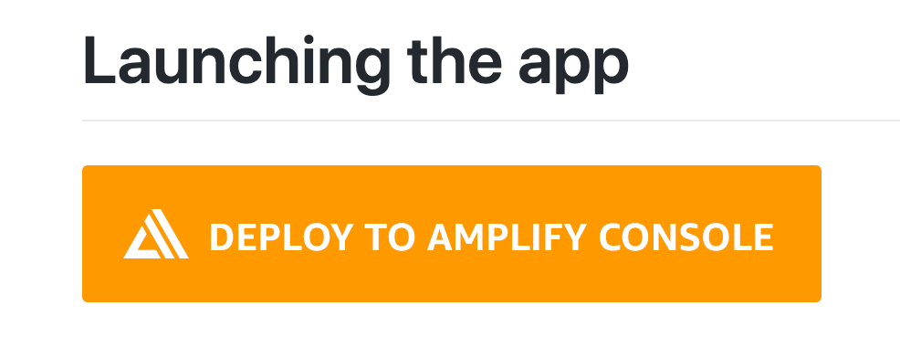

* Click the `Connect to GitHub` button

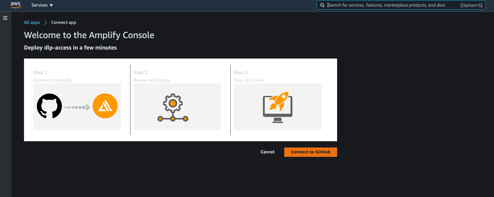

* Specify the `App name` and `Environment variable`

| Key | Value |
|----------|-------------|
| REACT_APP_REP_TYPE | demo |
| USER_DISABLE_TESTS | true |

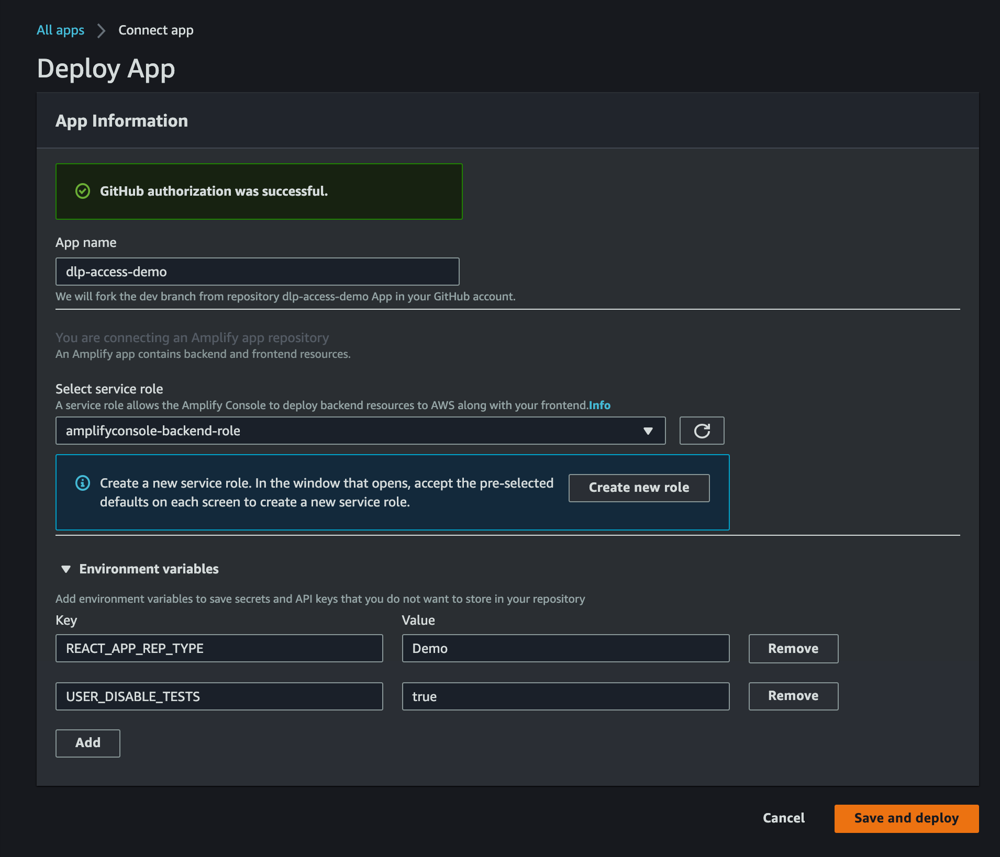

* Check the status and click the `Continue` button

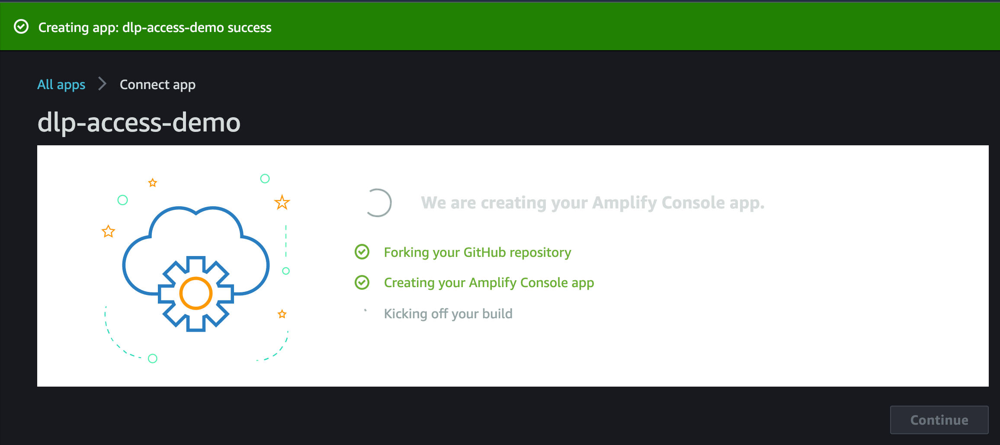

* Check the deployment status

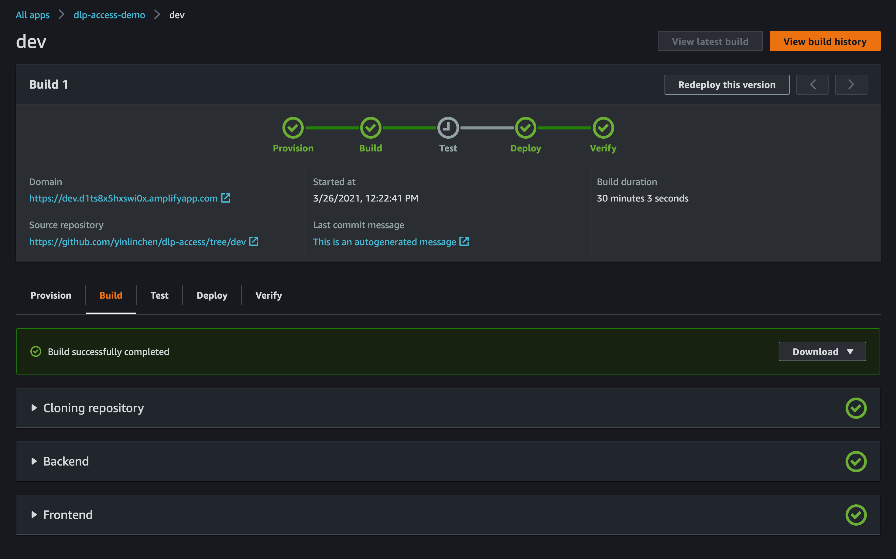

* Check the Backend environments

You will see the name of your backend environment for your application. See below, the backend envionment is `devp`

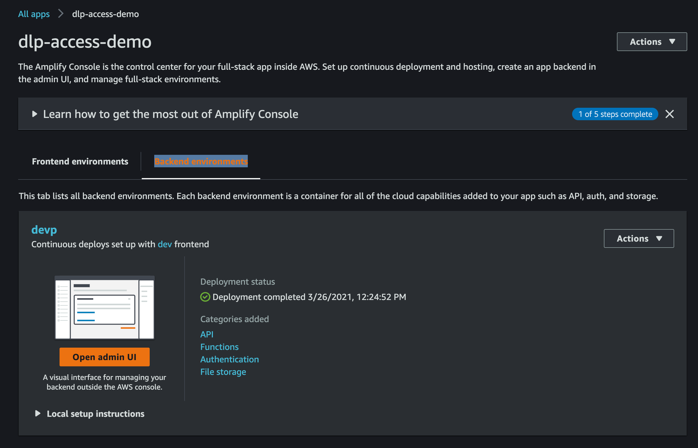

* Check the deployment in the Cloudformation

In the Cloudformation, select `Stacks` and type the name of the backend environment, e.g., `devp`. You will see the stack deployment, e.g. amplify-iawav2-`devp`-162417

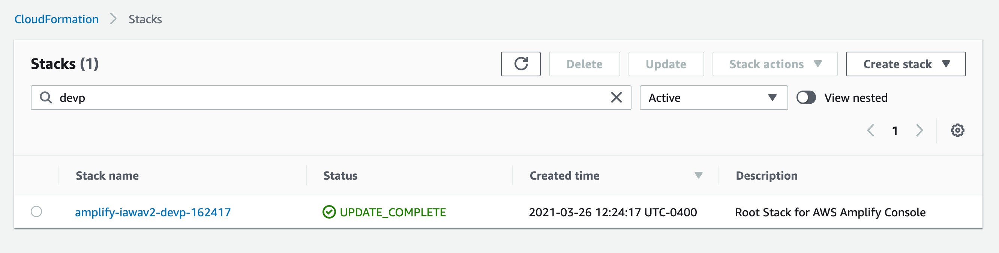


## Step 2: Add the site configuration data

* Tables in the DynamoDB

There are five tables been created after deployment. These table name are all contains the name of the backend envionment. You can list all these table by issue a query in the DynamoDB. See below:

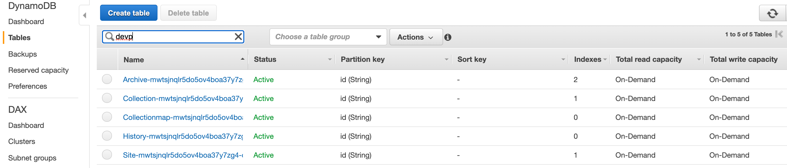

1. Site table

This table contains the information of the site configuration data. See a demo site configuation in [site.json](../examples/jsons/site.json). You can add this record(item) through the DynamoDB console or AWS CLI

```
aws dynamodb put-item --table-name Site-yourtablename --item file://site.json
```

You site will up with the basic setting. 

2. Collection table

This table contains the information of the collection data. See a demo collection in [democollection.json](../examples/jsons/democollection.json). You can add this record(item) through the DynamoDB console or AWS CLI

```
aws dynamodb put-item --table-name Collection-yourtablename --item file://democollection.json
```

You will see a `Demo collection` in the collection page

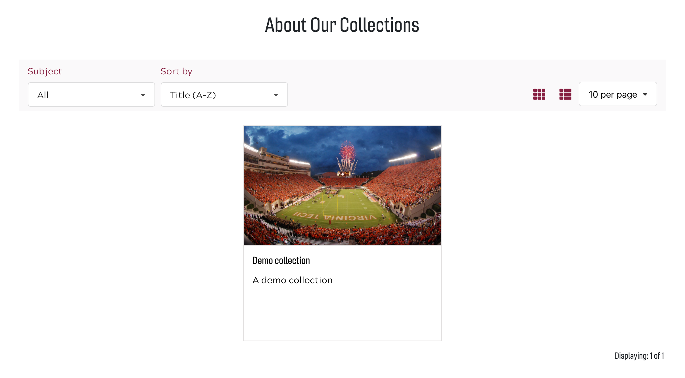

Note: currenly you need to also add a record in the `Collectionmap` table in order to display folder tree in the collection page. See a demo collectionmap in [democollectionmap.json](../examples/jsons/democollectionmap.json). You can add this record(item) through the DynamoDB console or AWS CLI

```
aws dynamodb put-item --table-name Collectionmap-yourtablename --item file://democollectionmap.json
```

You can see a `Demo collection` page looks like below

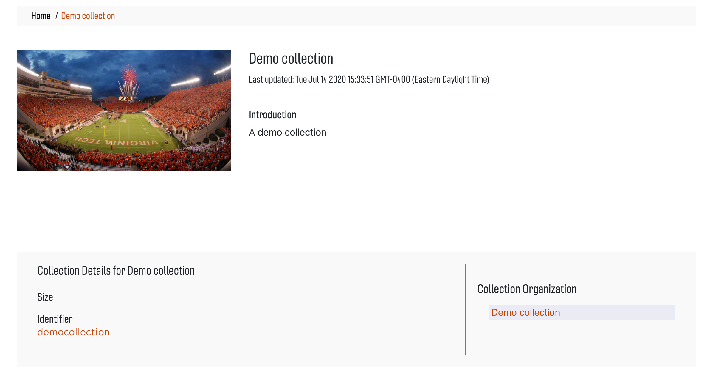

3. Archive (item) table

This table contains the information of the archive data. There are some sample archive data in the [examples/jsons](../examples/jsons/) folder. Archive sample data filename start with `archive_`. E.g., [archive_item1.json](../examples/jsons/archive_item1.json). You can add this record(item) through the DynamoDB console or AWS CLI

```
aws dynamodb put-item --table-name Archive-yourtablename --item file://archive_item1.json
```

You will see a list of demo items in the `Demo collection` page

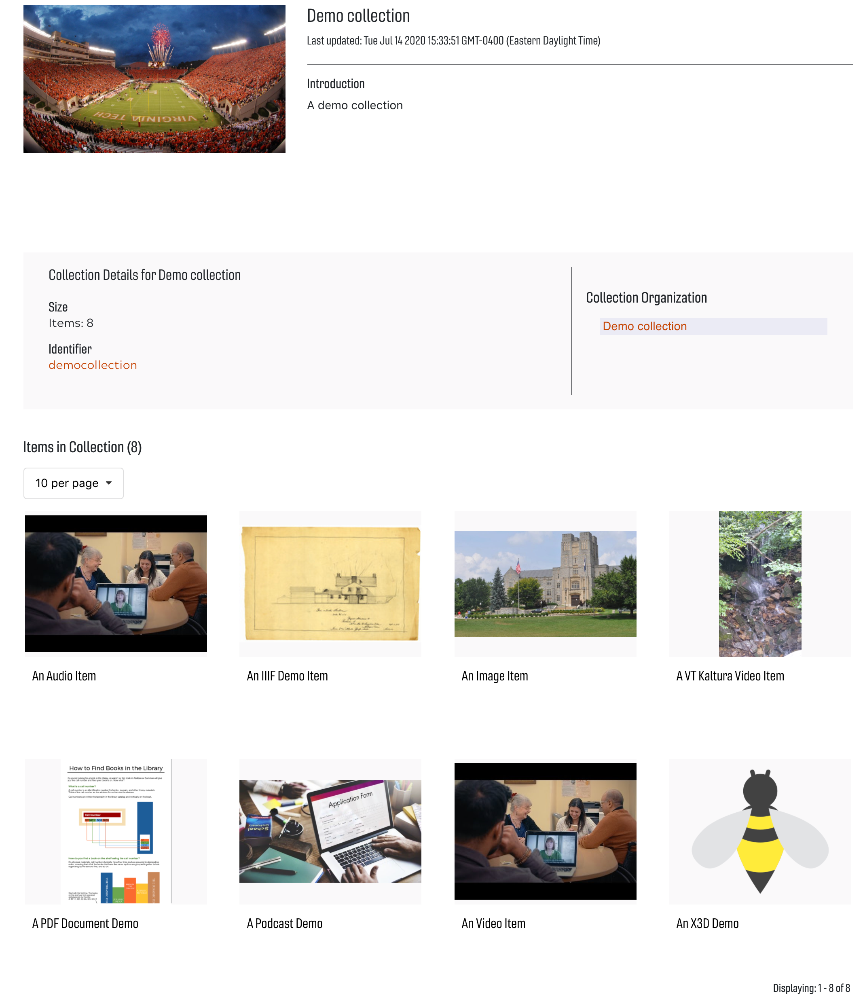

Currently we support image, video, audio, IIIF image, PDF, podcast, X3D, and VT Kaltura Video.  

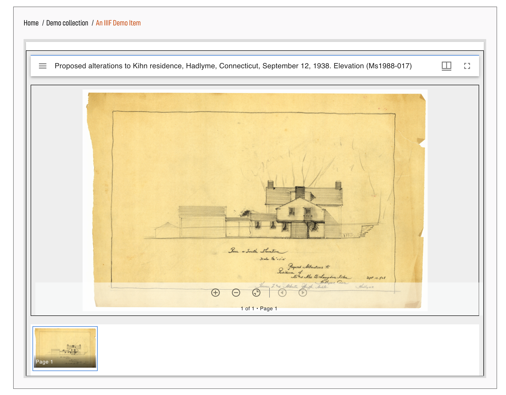
